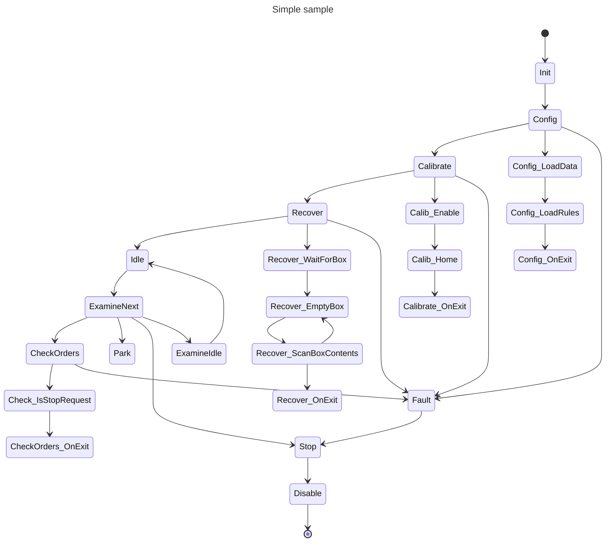

# LiteState (C#) - MK2 States with Messages

## Context Properties and Methods

Parameters:

* `Dictionary<int, object> Parameters` - _passing parameters to the next states_
* `Dictionary<int, object> Errors` - _Passing error type and payload information_
*

Methods:

* `SendMessage(int messageType, object payload)` - _Send message events to litening subscribers_
* `Next()` - _Automatically transion to the next default state_
* `Next(int stateId)` - _Transition to a custom state destination_
  * This methodology is not

### Context - `SendMessage`

The `context->SendMessage(...)` method allows for the sending messages to other awaiting mechanisms (_message processors_) so that they can perform an action and sent back a response. The utilizes the _**Publication/Subscription**_ system where a "request" is sent and a "response" is received back. When a message doesn't come back in time a **Timeout** must occur so that the system keeps moving; otherwise you'll be stuck in a state.

## Simple State Transitioning

```cs
// State("NameGraphViz", OnEnter, OnMessage, OnTimeout, OnExit, OnError, <int>msTimeout),
machine.State(StateId.Uninitialized, "Uninitialized", Uninitialized_OnEnter, NULL, NULL, Init_OnExit, Door_OnError)
					.AllowNext(StateId.Opened)
					.AllowNext(StateId.Closed);


```

## Forced-State Transition

By default you have 3 exit stratiges **OnSuccess**, **OnError** (_soft-error; return to parent_), and **OnFailure** (_critical-failure_). However, in rare cases you may have to allow the system to exit somewhere else


```cs
	// State("NameGraphViz", OnEnter, OnMessage, OnTimeout, OnExit, OnError, <int>msTimeout),
	_machine.State(StateId.Uninitialized, "Uninitialized", UninitializedOnEnter, NULL, NULL, InitOnExit, DoorOnError)
					.AllowNext(StateId.Opened)
					.AllowNext(StateId.Closed);
```

## Example State machine

The following example uses a robotic arm to pick apples. The system contains an "**Arm**" with 2 "**Hands**" for picking, a "**Box**" to put them in, and a _**database**_ for storing information.

The startup system goes as follows:

> NOTE: Step 6, **Examine** can transition to multiple different 'custom' states based upon a decision tree. This is different than the _default_ **success** state transition.

1. **Initialization** and Startup of the system
2. **Configure** the system - _load data_
3. **Calibrate** the system - _turn it on, enable, and "home"_
4. **Recover** the system - _remove unknown objects and put everything away_
   1. Make sure "Box" is back in it's place
   2. Throw away old apples you may be holding
   3. Put arm in a safe position
5. **Idle** State - _does nothing really_
6. **Examine** Next State - _Do we have work to do?_
7. **Check for Orders** for new apples to pick
   1. Did user press stop?
      1. Make everything "safe"
      2. Go to park position
   2. Is box full?
      1. Make box area safe (ensure no moving parts are near by)
      2. Empty the box (dump it on the ground)
      3. Scan the box. If it's not empty, dump it again (_up to 3 times_)
   3. **Drive-To-Next** - _move robot forward to the next tree_
   4. Scan tree for apples
      1. (move to each location and scan)
   5. **Examine** if we can pick anything (***)
      * MULTI-TRANSITIONS HERE!!!!
        1. We're done, box is full (Make Safe)
        2. Pick another
        3. User requested to stop
      * If nothing, GOTO->7.3) "Drive-To-Next", else, pick one
	 1. Pick Apple
   	 1. Grab apple from the tree
	 2. Place Apple into Box
   	 1. GOTO-> 7.5) **Examine** if there's anything to pick
8. **Stop** Requested
9. **Disable**
10. **End**

### State Tree

> **NOTE:** Every top-state (composite) can exit to the **Faulted** state on a critical error. At which point, the system will **Stop** and **Disable** itself for safety.



### Generic Timeout Handler


```cs
enum ApplePickerState =
{
	Uninitialized,
	Init,
	Recovery,				// Robotic system start-up/recovery
	Recovery_Arm,
	Recovery_Arm_WaitForBox,	// Box to dump apples into
	Recovery_Arm_Examine,			// Examine if we're holding something
	Recovery_Arm_Reject,			// Throw apples away
	Recovery_Arm_MakeSafe,		// Move arm back to resting position
	Opening,
	Opened,
	Closing,
	Closed,
	Error,
	// Faulting,
	// Faulted,
};


Result TopLevel_OnTimeout(Context context)
{
	var msgEvents
}
```


### Sample

```cpp
enum StateId =
{
	Uninitialized,
	Init,
	Opening,
	Opened,
	Closing,
	Closed,
	Error,
	// Faulting,
	// Faulted,
};

StateMachine _machine;

void Builder()
{
	// TODO: Add locks to door

	// CONCEPT ALT-DESIGN: Master OnError handler to reduce re-writing
	// _machine.OnError(StateId.Error, DoorOnError);

	// State("NameGraphViz", OnEnter, OnMessage, OnTimeout, OnExit, OnError, <int>msTimeout),
	_machine.State(StateId.Uninitialized, "Uninitialized", UninitializedOnEnter, NULL, NULL, InitOnExit, DoorOnError)
					.AllowNext(StateId.Opened)
					.AllowNext(StateId.Closed);

	// NOTE: Defining DoorOnError handler. Should we use a master 'catch all'?
	_machine.State(StateId.Init, "Init", InitOnEnter, NULL, NULL, InitOnExit, DoorOnError)
					.AllowNext(StateId.Opened)
					.AllowNext(StateId.Closed);

	// OnTimeout: Failed to open, go to Closed state.
	//// _machine.State(StateId.Opening, "Opening", OpeningOnEnter, NULL, NULL, OpeningOnTimeout, NULL, 5000) // in-line constructor
	_machine.State(StateId.Opening, "Opening")
					.OnEnter(OpeningOnEnter)
					.OnTimeout(OpeningOnTimeout, 5000)
					.AllowNext(StateId.Opened, true)    // Default Next state. Usage: `_state.Next();
					.AllowNext(StateId.Closed),

	_machine.State(StateId.Opened, "Opened")
					.OnEnter(DoorOpened_OnEnter)          // Optional: Add handler via chaining
					.OnMessage(DoorOpened_OnMessage)      // If (msg.Id == "DoorClose") state.Next(StateId.Closing)
					.AllowNext(StateId.Closing),

	// OnTimeout: Failed to close, go to Opened state
	_machine.State(StateId.Closing, "Closing", ClosingOnEnter, NULL, ClosingOnTimeout, NULL, 5000)
					.AllowNext(StateId.Opened)
					.AllowNext(StateId.Closed),

	_machine.State(StateId.Closed, "Closed", ClosedOnEnter),
					.AllowNext(StateId.Opening),
}
```